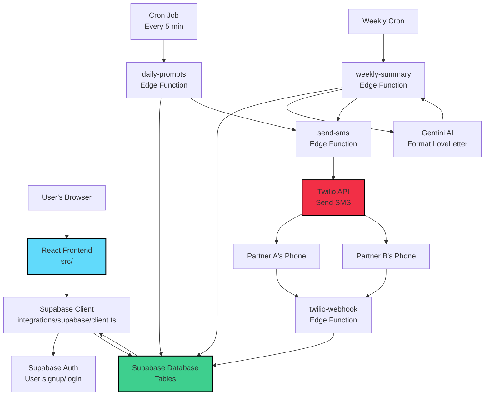

# Module 1: Project Overview - What is LoveNotes?

**Estimated time**: 60 minutes
**Prerequisites**: Module 0 (Development environment setup)
**What you'll build/learn**: Understand the complete user journey, system architecture, and how data flows through LoveNotes

## Overview

Now that you can run the app locally, let's step back and understand what LoveNotes actually does. In this module, we'll walk through the entire user journey - from signing up to receiving daily prompts to getting a weekly LoveLetter.

By the end, you'll be able to trace how a single feature works from start to finish, following the code from a button click in the browser all the way to the database.

**Key question we'll answer**: What happens when a couple signs up and starts receiving prompts?

## Concepts

### 1. Full-Stack Application

LoveNotes is a **full-stack application**, meaning it has both frontend (what users see) and backend (server logic).

**Frontend (React app)**:
- Lives in `/app/src/`
- Runs in the user's browser
- Handles UI, navigation, forms
- Makes requests to the backend

**Backend (Supabase)**:
- Database: Stores couples, prompts, responses
- Edge Functions: Serverless API endpoints (like mini-servers)
- Authentication: User login/signup
- Runs on Supabase's servers (not your computer)

Think of it like a restaurant:
- Frontend = dining room (where customers interact)
- Backend = kitchen (where the work happens)
- API = waiters (carrying requests back and forth)

### 2. State Machine

LoveNotes uses a **state machine** to track where each couple is in the prompt flow. A state machine is like a flowchart with rules about which transitions are allowed.

**The three states**:
1. **idle**: Ready to send the next Prime prompt
2. **prime_sent**: Prime sent, waiting 24 hours before sending Main
3. **main_sent**: Main sent, waiting 24 hours before advancing to next day

**The rules**:
- Can't send two prompts within 24 hours (prevents spam)
- Must alternate Prime → Main → advance day
- Each couple progresses independently

### 3. Database Schema

The database is organized into **tables** (like Excel spreadsheets). Each table stores a specific type of data with **relationships** between them.

**Key tables**:
- `profiles`: User accounts (email, name)
- `couples`: Relationship data (who's partnered, timezone, settings)
- `phone_subscriptions`: SMS subscription state (which day, which state)
- `prompts`: The curriculum questions (stored once, used for all couples)
- `prompt_deliveries`: Record of each SMS sent (who, when, what)
- `prompt_responses`: User replies to prompts

**Relationships**:
- One couple → one phone_subscription
- One phone_subscription → many prompt_deliveries
- One prompt_delivery → many prompt_responses (one per partner)

## Code Walkthrough

Let's trace the complete user journey through the codebase.

### Journey Step 1: User Signs Up (Frontend)

**File**: `/app/src/components/SignupForm.tsx`

When a user fills out the signup form and clicks submit, here's what happens:

```tsx
// Line 45-50 (simplified)
const handleSubmit = async (e: React.FormEvent) => {
  e.preventDefault();

  // 1. Create auth account
  const { data, error } = await supabase.auth.signUp({
    email: formData.email,
    password: formData.password,
  });

  // 2. Redirect to onboarding
  navigate("/onboarding");
};
```

**What this does**:
1. Prevents default form submission (which would reload the page)
2. Calls Supabase's `signUp` method to create a user account
3. Redirects to the onboarding flow

**Supabase connection**: The `supabase` object comes from:

**File**: `/app/src/integrations/supabase/client.ts`

```ts
// Line 11-17
export const supabase = createClient<Database>(
  SUPABASE_URL,
  SUPABASE_PUBLISHABLE_KEY,
  {
    auth: {
      storage: localStorage,        // Store login session in browser
      persistSession: true,          // Stay logged in
      autoRefreshToken: true,        // Refresh when expired
    }
  }
);
```

This creates a client that connects your frontend to Supabase's backend. Every database query and auth request goes through this client.

### Journey Step 2: Onboarding (Creating a Couple)

**File**: `/app/src/pages/Onboarding.tsx` (conceptual - actual implementation may vary)

After signup, the user provides:
- Partner's name
- Both phone numbers
- Timezone
- Preferred time to receive prompts

This data creates entries in two tables:
1. `couples` table (relationship info)
2. `phone_subscriptions` table (SMS settings + state machine)

**Database structure** (from technical.md):

```sql
-- couples table
{
  id: uuid,
  primary_user_id: uuid,          -- References profiles table
  partner_name: text,
  timezone: text,                 -- e.g., "America/Los_Angeles"
  daily_send_time_local: time,    -- e.g., "09:00:00"
  status: text,                   -- "active", "paused", etc.
}

-- phone_subscriptions table
{
  id: uuid,
  couple_id: uuid,                -- References couples table
  primary_phone: text,            -- e.g., "+14155551234"
  secondary_phone: text,
  current_week: integer,          -- 1-8
  current_day: integer,           -- 1-64 (absolute day in curriculum)
  current_cycle_state: text,      -- "idle", "prime_sent", "main_sent"
  last_prime_sent_at: timestamp,
  last_main_sent_at: timestamp,
  is_active: boolean,
}
```

### Journey Step 3: Daily Prompts (Backend Edge Function)

Every 5 minutes, a cron job calls the `daily-prompts` edge function to check if anyone is due for a prompt.

**File**: `/app/supabase/functions/daily-prompts/index.ts`

**High-level flow**:
```
1. Get all active subscriptions
2. For each subscription:
   a. Check if 24 hours passed since last prompt
   b. Check if current time matches their preferred send time
   c. Determine: should we send Prime or Main? (based on day number)
   d. If eligible, send the prompt via send-sms function
   e. Update state machine (idle → prime_sent or prime_sent → main_sent)
```

**The key logic** (from `/app/supabase/functions/_shared/lib/prompt-logic.ts`):

```ts
// Line 11-26
export function determinePromptCategory(
  curriculumVersion: string,
  currentDay: number,
  cycleState?: string
): 'Prime' | 'Main' | null {
  const isV41 = curriculumVersion === 'v4.1';

  if (isV41) {
    // Sequential-day pattern: odd days = Prime, even days = Main
    return currentDay % 2 === 1 ? 'Prime' : 'Main';
  } else {
    // Older version used state machine
    return null;
  }
}
```

**What this means**:
- Day 1 (odd) → send Prime
- Day 2 (even) → send Main
- Day 3 (odd) → send Prime
- And so on...

**The 24-hour gap check** (line 33-58):

```ts
export function hasMetGlobalGap(
  lastPromptAt: string | null,
  currentTime: Date,
  isTestMode: boolean,
  overrideGap: boolean = false
): { gapMet: boolean; elapsed: number; threshold: number; unit: string } {
  if (overrideGap || !lastPromptAt) {
    return { gapMet: true, elapsed: 0, threshold: 0, unit: 'minutes' };
  }

  const lastSent = new Date(lastPromptAt);
  const elapsedMs = currentTime.getTime() - lastSent.getTime();
  const elapsed = isTestMode
    ? elapsedMs / (60 * 1000)         // Test mode: 2 minutes
    : elapsedMs / (60 * 60 * 1000);   // Production: 24 hours

  const threshold = isTestMode ? 2 : 23.5;

  return {
    gapMet: elapsed >= threshold,
    elapsed,
    threshold,
    unit: isTestMode ? 'minutes' : 'hours'
  };
}
```

**Key insight**: The function uses **23.5 hours** (not exactly 24) to prevent edge cases where the cron runs slightly before the 24-hour mark.

### Journey Step 4: Sending SMS (Twilio Integration)

**File**: `/app/supabase/functions/send-sms/index.ts`

When `daily-prompts` determines a prompt should be sent, it calls this function:

```ts
// Simplified pseudocode
async function sendSMS(to: string, message: string, deliveryId: string) {
  // 1. Authenticate (service role key required)
  if (!isAuthorized(request)) {
    return 401 Unauthorized;
  }

  // 2. Check if test mode (logs instead of sending)
  const delivery = await db.get('prompt_deliveries', deliveryId);
  if (delivery.is_virtual_test) {
    await db.insert('test_messages', { to, message });
    return;
  }

  // 3. Actually send via Twilio
  const response = await twilioClient.messages.create({
    to: to,
    from: TWILIO_PHONE_NUMBER,
    body: message,
  });

  // 4. Update delivery status
  await db.update('prompt_deliveries', {
    id: deliveryId,
    twilio_message_sid: response.sid,
    delivery_status: 'sent',
  });
}
```

**Security note** (line 29-37):
```ts
// Since verify_jwt is disabled, enforce internal auth via service role header.
const authHeader = req.headers.get("authorization") || "";
const expected = `Bearer ${supabaseKey}`;
if (authHeader !== expected) {
  console.error("❌ Unauthorized send-sms call");
  return new Response(JSON.stringify({ error: "Unauthorized" }), {
    status: 401,
  });
}
```

This prevents random people from calling the function and sending SMS. Only other edge functions with the service role key can call it.

### Journey Step 5: Receiving Responses (Twilio Webhook)

When a user texts back, Twilio sends the response to the `twilio-webhook` edge function.

**File**: `/app/supabase/functions/twilio-webhook/index.ts` (conceptual)

**Flow**:
```
1. Receive SMS from Twilio
2. Extract: From (phone number), Body (text content)
3. Normalize phone number (+1-555-123-4567 → +15551234567)
4. Find phone_subscription matching this number
5. Get all recent Main prompts for this partner (last 48 hours)
6. Pair response to OLDEST unanswered Main (smart pairing)
7. Save to prompt_responses table
8. Notify opposite partner: "X wrote you a love note! 💙"
```

**Smart pairing**: If multiple Main prompts were sent (maybe they answered late), the system pairs the response to the **oldest unanswered** one. This prevents confusion when responses come out of order.

### Journey Step 6: Weekly LoveLetters (AI Compilation)

Once a week, the `weekly-summary` function runs to check which couples have completed enough rounds.

**File**: `/app/supabase/functions/weekly-summary/index.ts`

**Eligibility criteria**:
```
Couple needs 4 complete rounds:
- Round = both partners responded to the same Main prompt
- 4 rounds = 8 total responses (4 from each partner)
```

**Flow**:
```
1. Find couples with 4+ complete rounds since last LoveLetter
2. For each eligible couple:
   a. Fetch all responses with their original questions
   b. Send to Gemini AI with curator prompt
   c. AI formats as LoveLetter (preserves exact quotes)
   d. Split letter into ~320 character parts (SMS limit)
   e. Send parts sequentially with 2-second delay
   f. Update last_weekly_summary_sent_at
```

**AI prompt style**: "Act as a curator, not an interpreter. Preserve their exact words. Add only structural framing to show themes."

### Journey Step 7: Viewing Dashboard (User Sees History)

**File**: `/app/src/pages/Dashboard.tsx`

Users can log in and see their prompt history:

```tsx
// Line 88-100 (simplified)
const { data: deliveryData } = await supabase
  .from("prompt_deliveries")
  .select(`
    id,
    sent_at,
    delivery_status,
    prompt_category,
    prompts (prompt_text),
    prompt_responses (body_text, from_phone)
  `)
  .eq("subscription_id", phoneSub?.id)
  .order("sent_at", { ascending: false })
  .limit(7);
```

**What this query does**:
1. Get prompt deliveries for this subscription
2. Include related data: the prompt text, and all responses
3. Order by most recent first
4. Limit to last 7 deliveries

**The result** looks like:
```json
[
  {
    "id": "abc-123",
    "sent_at": "2026-01-13T09:00:00Z",
    "prompt_category": "Main",
    "prompts": {
      "prompt_text": "What's one small thing your partner did this week that you appreciated?"
    },
    "prompt_responses": [
      { "body_text": "Made me coffee", "from_phone": "+15551234567" },
      { "body_text": "Listened to my day", "from_phone": "+15559876543" }
    ]
  }
]
```

The frontend then renders this as a list of cards showing the question and both partners' responses.

## System Architecture Diagram

Here's how all the pieces connect:



**Key takeaway**: The frontend (React) only talks to Supabase. Supabase handles everything else - database, authentication, and running edge functions. Edge functions are like mini-servers that run on-demand.

## Try It Yourself

### Exercise 1: Trace a User Flow

Let's follow what happens when someone clicks "Get Early Access" on the home page.

**Step 1**: Make sure the app is running (`npm run dev`)

**Step 2**: Open your browser's DevTools (F12) and go to the **Network** tab

**Step 3**: On the home page, click "Get Early Access" (it scrolls to the signup form)

**Step 4**: Fill out the form with fake data (no need to submit) and watch the Network tab

**Question for you**: Where does the "Get Early Access" button navigate to? Let's find it in the code.

**Step 5**: Open `/app/src/components/NewHero.tsx`

**Step 6**: Find the button (around line 44):

```tsx
<Button onClick={scrollToSignup} size="lg" className="...">
  Get Early Access
</Button>
```

**Step 7**: Look at the `scrollToSignup` function (line 4-8):

```tsx
const scrollToSignup = () => {
  document.getElementById("signup")?.scrollIntoView({
    behavior: "smooth"
  });
};
```

**Success criteria**: You understand that the button doesn't navigate to a new page - it scrolls to an element with id="signup" on the same page.

### Exercise 2: Explore the Database Schema

Let's look at how data is organized.

**Step 1**: Open `/app/supabase/migrations/` folder in VS Code

**Step 2**: Find the earliest migration file (lowest timestamp, like `20251110214502_...sql`)

**Step 3**: Open it and look for `CREATE TABLE` statements

**Example** (you'll see something like this):

```sql
CREATE TABLE profiles (
  id UUID PRIMARY KEY DEFAULT gen_random_uuid(),
  email TEXT UNIQUE NOT NULL,
  name TEXT,
  created_at TIMESTAMP DEFAULT NOW()
);

CREATE TABLE couples (
  id UUID PRIMARY KEY DEFAULT gen_random_uuid(),
  primary_user_id UUID REFERENCES profiles(id),
  partner_name TEXT,
  timezone TEXT DEFAULT 'America/Los_Angeles',
  status TEXT DEFAULT 'active'
);
```

**Question for you**: What does `REFERENCES profiles(id)` mean?

**Answer**: It's a **foreign key** - it creates a relationship. Every couple must have a `primary_user_id` that exists in the `profiles` table. This prevents orphaned data.

**Step 4**: Draw a simple diagram on paper:

```
profiles (users)
   |
   | (one-to-many)
   |
   v
couples (relationships)
   |
   | (one-to-one)
   |
   v
phone_subscriptions (SMS state)
```

**Success criteria**: You understand that profiles → couples → phone_subscriptions form a chain of relationships.

### Exercise 3: Follow a Function Call

Let's trace how the Supabase client is used.

**Step 1**: Open `/app/src/pages/Dashboard.tsx`

**Step 2**: Find where it imports `supabase` (line 3):

```tsx
import { supabase } from "@/integrations/supabase/client";
```

**Note**: The `@/` symbol is an alias for `/app/src/`. It's defined in the build config to avoid messy relative paths like `../../../`.

**Step 3**: Find where it's used to fetch data (around line 70):

```tsx
const { data: couple } = await supabase
  .from("couples")
  .select("id, status")
  .eq("primary_user_id", session.user.id)
  .single();
```

**What this does**:
- `.from("couples")` - query the couples table
- `.select("id, status")` - only get these two columns
- `.eq("primary_user_id", session.user.id)` - where primary_user_id equals the logged-in user's id
- `.single()` - expect exactly one result (throws error if 0 or multiple)

**Step 4**: Add a console log to see the data. After line 74, add:

```tsx
console.log("Couple data:", couple);
```

**Step 5**: Save the file, log into the app (you'll need valid credentials), and check the browser console.

**Success criteria**: You see the couple data object logged (or an error if you're not logged in).

### Exercise 4: Understand the State Machine

**Step 1**: Re-read the "State Machine" concept section above

**Step 2**: Open `/app/supabase/functions/_shared/lib/prompt-logic.ts`

**Step 3**: Look at the `determinePromptCategory` function (line 11-26)

**Question**: If a couple is on day 5, what type of prompt will they get?

**Work it out**:
- `currentDay = 5`
- `5 % 2 === 1` (5 divided by 2 has remainder 1, so it's odd)
- Odd days → `'Prime'`

**Answer**: They get a Prime prompt on day 5.

**Step 4**: What about day 8?

- `currentDay = 8`
- `8 % 2 === 0` (8 divided by 2 has remainder 0, so it's even)
- Even days → `'Main'`

**Answer**: Main prompt on day 8.

**Success criteria**: You understand how the modulo operator (`%`) is used to alternate between Prime and Main prompts.

## Troubleshooting

### Problem: "I don't understand edge functions"

**Explanation**: Edge functions are like mini-servers that run on-demand. They're written in TypeScript (using Deno runtime) and deployed to Supabase. Think of them as serverless endpoints - you write the function, Supabase handles running it.

**Example**: When a cron job needs to send prompts, it makes an HTTP request to the `daily-prompts` edge function URL. Supabase receives the request, runs your function code, and returns the result.

### Problem: "What's the difference between Deno and Node.js?"

**Answer**: Both are JavaScript runtimes (they execute JS code outside a browser), but:
- **Node.js**: Older, uses CommonJS modules (`require()`), has npm
- **Deno**: Newer, built by Node's creator, uses ES modules (`import`), more secure

Supabase edge functions use Deno. The main difference you'll notice: imports look like `import { serve } from "https://deno.land/std@0.168.0/http/server.ts"` (URL imports instead of package names).

### Problem: "How do I know which function to read first?"

**Start with the user journey**:
1. Signup? → Look at `SignupForm.tsx`
2. Prompts being sent? → Look at `daily-prompts` function
3. Responses? → Look at `twilio-webhook` function

**Follow the data flow**: UI component → Supabase client → Database or Edge Function → Database

## Key Takeaways

✅ **User journey**: Signup → Onboarding → Daily prompts → Responses → Weekly LoveLetter
✅ **Architecture**: React frontend talks to Supabase backend (database + edge functions)
✅ **State machine**: Couples progress through idle → prime_sent → main_sent → repeat
✅ **24-hour gap**: Prevents spam by enforcing minimum time between prompts
✅ **Smart pairing**: Responses match to oldest unanswered Main prompt
✅ **Database relationships**: profiles → couples → phone_subscriptions form a chain
✅ **Edge functions**: Serverless functions that run backend logic (daily-prompts, send-sms, etc.)

## What's Next

In **Module 2**, we'll dive into React fundamentals using actual LoveNotes components. You'll learn how components work, how props pass data, how to read JSX and TypeScript, and you'll make your first real code changes.

**Preview**: We'll modify the hero section, add a console log to track navigation, and trace how a button click triggers component rendering.

## Further Exploration

**Challenge 1: Find the Prompt Text**

The curriculum (all 64 prompts) is stored in the database. Can you find where prompts are queried in the `daily-prompts` function?

**Hint**: Look for `.from("prompts")` in `/app/supabase/functions/daily-prompts/index.ts`

**Challenge 2: Map the Routes**

Open `/app/src/App.tsx` and list all the routes. What URL would you visit to see:
- The home page?
- The login page?
- The dashboard?
- The admin panel?

**Challenge 3: Understand the ER Diagram**

Re-read the database schema section. Draw your own ER diagram on paper showing:
- Tables as boxes
- Relationships as arrows
- What each arrow means (one-to-one, one-to-many)

**Challenge 4: Explore the Network Tab**

With the app running and DevTools open:
1. Go to Network tab
2. Refresh the page
3. Filter by "Fetch/XHR"
4. Click on a request to see headers and response

What API calls does the home page make? (Hint: Look for requests to Supabase)

**Challenge 5: Read a Migration**

Pick a migration file and read through it. Can you identify:
- Which tables it creates or modifies?
- What columns are added?
- Any indexes or constraints?

---

**Ready for Module 2?** Make sure you understand the user journey and can trace data flow from frontend to backend. These mental models will make the rest of the course much easier!
